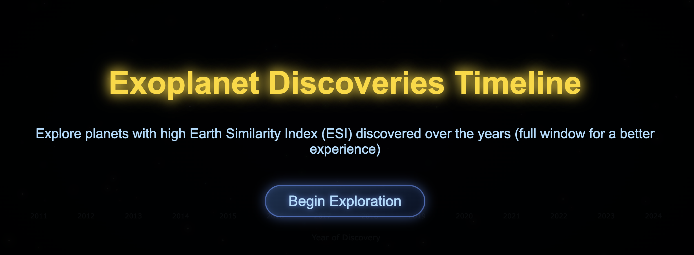

# 🪐 Exoplanet Discovery Timeline & ESI Calculator

Interactive data visualization project that analyzes NASA's exoplanet archive to identify potentially habitable worlds using the **Earth Similarity Index (ESI)**.



## 📊 Overview

This project combines Data Science with Web Visualization to explore the history of exoplanet discoveries.

- **Data Processing**: Python scripts ingest raw NASA data, cleaning and filtering candidates.
- **Math Modeling**: Calculates the _Earth Similarity Index_ based on planetary radius, density, escape velocity, and surface temperature.
- **Visualization**: An interactive D3.js/JS timeline allowing users to explore the universe's candidates.

## 🧮 The Math: Earth Similarity Index (ESI)

The core of the analysis is the ESI formula, implemented in Python:

$$ESI = \prod_{i=1}^{n} \left(1 - \left| \frac{x_i - x_{i0}}{x_i + x_{i0}} \right| \right)^{\frac{w_i}{n}}$$

_(See `compute_esi.py` for implementation details)_

## 🛠️ Tech Stack

- **Backend / Processing**: Python 3, Pandas, NumPy, Flask.
- **Frontend**: HTML5, CSS3, Vanilla JavaScript.
- **Data Source**: NASA Exoplanet Archive.

## 🚀 How to Run Locally

1.  **Clone the repository:**

    ```bash
    git clone [https://github.com/alvarorm3008/VISUALIZATION-UIB.git](https://github.com/alvarorm3008/VISUALIZATION-UIB.git)
    cd VISUALIZATION-UIB
    ```

2.  **Set up the environment:**

    ```bash
    python3 -m venv venv
    source venv/bin/activate  # On Windows: venv\Scripts\activate
    pip install -r requirements.txt
    ```

3.  **Launch the Visualization:**
    ```bash
    python serving_archivos.py
    ```
    Open your browser at `http://127.0.0.1:5000/timeline.html`

---

**Author:** Alvaro Rodriguez and Agustin Soares
